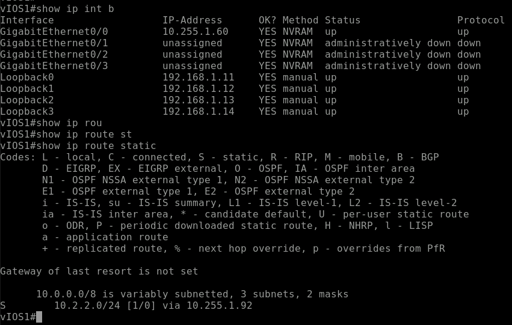
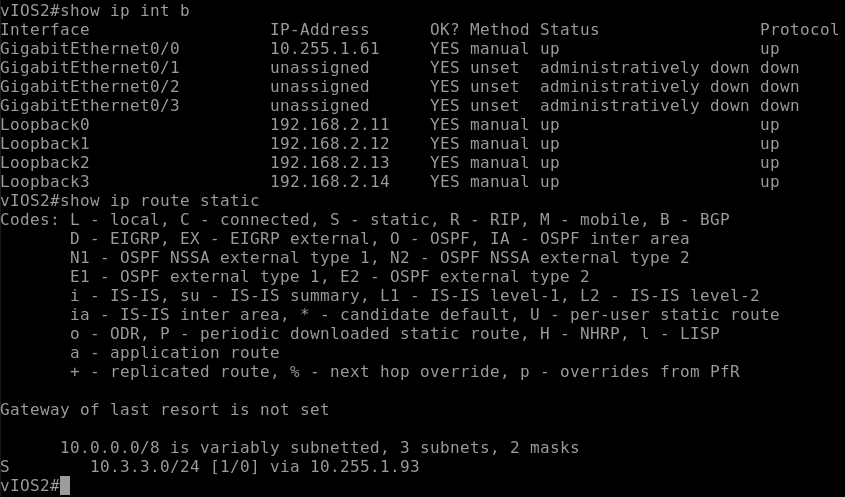
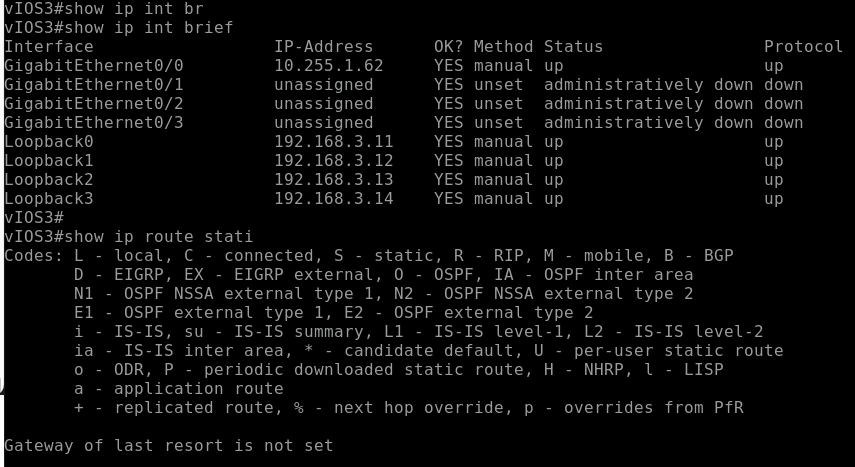

# Ansible IOS Loopback & Static Route Automation

This project demonstrates network automation using Ansible to configure loopback interfaces and static routes across multiple Cisco IOS routers.

The configuration is fully data-driven using `group_vars` and `host_vars`, enabling scalable and reusable deployments.

---

## Project Overview

This playbook performs the following tasks:

- Configures multiple loopback interfaces on each router
- Assigns IP addresses and descriptions dynamically
- Adds static routes (only if defined per device)
- Verifies loopback interfaces configuration
- Verifies static routes in the routing table

---

## Technologies Used

- Ansible
- Cisco IOS (IOSv)
- YAML (data modeling)
- Ansible Vault (for secrets management)

---

## Secrets Management

Sensitive data such as device credentials are **not stored in plain text**.

This project uses **Ansible Vault** to encrypt secrets.

### How it works

The inventory references a variable:

ansible_password={{ vault_ansible_password }}

The actual password is stored securely in:

group_vars/vault.yml

This file is encrypted using:

ansible-vault encrypt group_vars/vault.yml

---

### Verification Tasks

The playbook validates configuration using:

- `show ip interface brief`
- `show ip route static`

---
## Configuration Results

### Router R1
Loopback interfaces and static route successfully configured.

  

---

### Router R2
Loopback interfaces and static route successfully configured.

  

---

### Router R3
Only loopback interfaces are configured.  
No static routes are present, as expected.

  

---

### Observation

This behavior confirms that the playbook correctly applies **conditional logic**:

- Static routes are only configured when defined in `host_vars`
- Router **R3** does not include `static_routes`, so no routes were applied

when: static_routes is defined

---

## Notes

- All IP addresses and credentials are part of a **simulated lab environment**
- This project is designed for **learning and demonstration purposes**

---

##  Key Design Principles

- **Infrastructure as Code (IaC)**
- **Data-driven automation**
- **Modular configuration using variables**
- **Secure credential management**

---

## Author

**Amina Ahmed**  
Packet Core & IP Network Engineer | Network Automation Enthusiast

